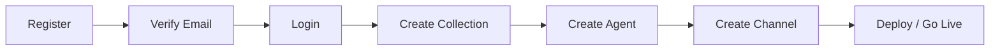
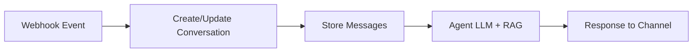
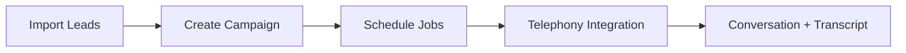

# Business Requirements Document (BRD)

## Avakado AI Agent SaaS Platform (AVA_SAAS)

| Field | Value |
|-------|-------|
| **Product** | Avakado (AVA) — Multi-tenant AI Agent SaaS |
| **Codebase** | `ava_saas` backend (Node.js / Express / Apollo GraphQL) |
| **Document version** | 1.0 |
| **Generated from** | Source code analysis (May 2026) |
| **Primary endpoint** | `POST /graphql` |
| **Public URL** | https://www.avakado.ai |

---

## 1. Executive Summary

Avakado is a **multi-tenant SaaS platform** that enables businesses to build, configure, deploy, and operate **AI-powered conversational agents** across multiple communication channels (web chat, WhatsApp, Telegram, email, SMS, voice, Instagram, Twilio).

The platform combines:

- **Knowledge management** (RAG) via collections sourced from websites, files, YouTube, and plain text
- **Custom agent configuration** (prompts, models, appearance, voice, actions, workflows)
- **Omnichannel deployment** with webhook-driven inbound messaging
- **Outbound campaigns** and scheduled jobs for telephony (Twilio, Exotel, Tata Tele)
- **CRM-style lead management** with templates and bulk import
- **Subscription billing** via Razorpay with credit-based usage (LLM, knowledge, miscellaneous)
- **Third-party integrations** (Zoho CRM, Twilio Connect, OAuth providers)
- **Support ticketing** and in-app notifications

This BRD is derived from the implemented backend (`src/`) and reflects **what the system does today**, not a future roadmap.

---

## 2. Business Objectives

| ID | Objective | Success Criteria |
|----|-----------|------------------|
| BO-01 | Enable businesses to deploy branded AI agents without building infrastructure | Tenant can register, create agent, attach knowledge, and go live on ≥1 channel |
| BO-02 | Centralize knowledge ingestion and retrieval for accurate agent responses | Collections process website/file/YouTube sources into embedded chunks |
| BO-03 | Support omnichannel customer engagement | Agents operate on web, messaging, email, SMS, and voice channels |
| BO-04 | Monetize via subscription plans and usage credits | Plans, subscriptions, and per-business credit balances enforced |
| BO-05 | Provide outbound sales/support automation | Campaigns schedule outbound calls with agent context |
| BO-06 | Integrate with external CRM and telephony systems | Zoho, Twilio, Exotel, Tata Tele connectors available |
| BO-07 | Maintain tenant isolation and role-based access | All tenant data scoped to `business`; scopes gate GraphQL operations |

---

## 3. Stakeholders & User Roles

### 3.1 Stakeholders

| Stakeholder | Interest |
|-------------|----------|
| **Business tenant (customer)** | Configure agents, knowledge, channels, campaigns; view analytics |
| **Platform operator (Avakado)** | Manage plans, super-admin operations, marketplace templates |
| **End user (consumer)** | Interacts with deployed agents via channels (no direct platform login) |
| **QA / Engineering** | API contracts, test fixtures, integration verification |

### 3.2 Platform User Roles

| Role | Description | Default Capabilities |
|------|-------------|---------------------|
| **superAdmin** | Platform-level administrator | `super:all` and full admin scopes |
| **admin** | Business owner / primary administrator | Full CRUD on agents, collections, channels, integrations, workflows, billing upgrade |
| **manager** | Limited operational user | Read-heavy: conversations, analytics, tickets; limited create on tickets |

Roles are assigned at registration (`admin` for business creator) or via `createUser` mutation.

---

## 4. Functional Requirements

### 4.1 Authentication & Onboarding

| ID | Requirement | Implementation |
|----|-------------|----------------|
| FR-AUTH-01 | User registration creates **User + Business** atomically | `register` mutation; MongoDB transaction |
| FR-AUTH-02 | Email verification required before login | `isVerified` flag; verification email via `WEBHOOKS_URL` |
| FR-AUTH-03 | Login returns JWT access token, role, scopes, user profile | `login` mutation; cookies supported via middleware |
| FR-AUTH-04 | Scope-based authorization on GraphQL fields | Directives: `@requireScope`, `@requireBusinessAccess`, `@requireResourceOwnership` |
| FR-AUTH-05 | Public operations without auth | `login`, `register`, `ephemeralToken`, `fetchPublicPlans`, introspection |

**Business rules:**

- Duplicate business name or email rejected at registration
- Password hashed with bcrypt (12 rounds)
- Access/refresh tokens: JWT, default 30-day expiry

### 4.2 Business (Tenant) Management

| ID | Requirement | Details |
|----|-------------|---------|
| FR-BIZ-01 | Each user belongs to one business | `User.business` → `Business` |
| FR-BIZ-02 | Business profile includes branding and contact | name, logoURL, sector, tagline, facts, quickQuestions, address, description, contact |
| FR-BIZ-03 | Credit wallet per business | `llmCredits`, `knowledgeCredits`, `miscellaneousCredits`, `balance`, active subscription plan |
| FR-BIZ-04 | Usage analytics tracked | engagement overview, conversation analytics, credit usage breakdown (chat, knowledge, analysis) |
| FR-BIZ-05 | Conversation date retention | `MAX_DAYS` default 45; pruning of old daily counts |

### 4.3 AI Agent Management

| ID | Requirement | Details |
|----|-------------|---------|
| FR-AGENT-01 | Create/update/delete agents per business | CRUD mutations with `agent:*` scopes |
| FR-AGENT-02 | Agent configuration | appearance (color boxes), personalInfo (name, systemPrompt, quickQuestions, welcomeMessage, model, temperature, VoiceAgentSessionConfig) |
| FR-AGENT-03 | Agent associations | collections[], workflow, channels[], actions[] |
| FR-AGENT-04 | Public/featured agents | `isPublic`, `isFeatured` flags for marketplace |
| FR-AGENT-05 | Voice realtime sessions | `ephemeralToken` (OpenAI or Gemini provider) — public operation |
| FR-AGENT-06 | Prompt generation helper | `generatePrompt` mutation for AI-assisted prompt building |
| FR-AGENT-07 | Analysis metrics | `analysisMetrics` JSON on agent |

**Supported voice models (from schema):** OpenAI realtime models, voices (alloy, ash, coral, etc.), turn detection (server_vad, semantic_vad).

### 4.4 Knowledge Collections (RAG)

| ID | Requirement | Details |
|----|-------------|---------|
| FR-COLL-01 | Collection types by source | `website`, `youtube`, `file`, `text` |
| FR-COLL-02 | Processing status lifecycle | `loading` → `active` or `failed` |
| FR-COLL-03 | Website ingestion | Firecrawl batch scrape; webhook callback on completion |
| FR-COLL-04 | File ingestion | Presigned upload to Cloudflare R2 (`ava-client-documents`); LlamaParse parsing via `source_url` |
| FR-COLL-05 | Chunking strategies | `recursiveStructural`, `recursiveSemantic` with tunable JSON |
| FR-COLL-06 | Parser tiers | `fast`, `cost_effective`, `agentic`, `agentic_plus` |
| FR-COLL-07 | Parser output expansion | text, items, markdown, metadata, images_content_metadata, xlsx_content_metadata, output_pdf_content_metadata |
| FR-COLL-08 | File storage operations | `getUploadUrl`, `getDownloadUrl`, `deleteUploadedFileFromStorage`, `getListOfUploadedFiles` |
| FR-COLL-09 | Direct upload (Multer) | PDF and TXT up to 50MB (middleware exists; route wiring optional) |

**Business rule:** Knowledge processing consumes `knowledgeCredits`; embeddings and summarization costs tracked in business analytics.

### 4.5 Custom Actions (Agent Tools)

| ID | Requirement | Details |
|----|-------------|---------|
| FR-ACT-01 | Define executable JavaScript functions | `functionString`, `errorFunction` |
| FR-ACT-02 | Parameter schema | `parameters` JSON; `config` JSON |
| FR-ACT-03 | Execution controls | `async`, `needsApproval` flags |
| FR-ACT-04 | UI rendering config | `UI` JSON for action presentation |
| FR-ACT-05 | Public actions | `isPublic` for marketplace sharing |

### 4.6 Communication Channels

| ID | Requirement | Channel Types |
|----|-------------|---------------|
| FR-CHAN-01 | Create channel per type | email, whatsapp, telegram, web, phone, sms, instagram, twilio |
| FR-CHAN-02 | Channel configuration | `config` JSON, `systemPrompt`, `UIElements`, optional `workflow` link |
| FR-CHAN-03 | Webhook URL per channel | Auto-generated for inbound message routing |
| FR-CHAN-04 | OAuth integrations | Google, Microsoft, Instagram, WhatsApp, Twilio Connect under `src/services/Oauth/` |

### 4.7 Conversations & Messages

| ID | Requirement | Details |
|----|-------------|---------|
| FR-CONV-01 | Store conversation sessions | Linked to agent, channel, optional campaign, workflow state |
| FR-CONV-02 | Conversation statuses | initiated, active, interrupted, inactive, disconnected, noAnswer, busy, failed, completed, inProgress |
| FR-CONV-03 | Metadata tracking | totalMessages, reactions (like/dislike/neutral), userLocation, socket info, browserUrl |
| FR-CONV-04 | Transcripts & extracted data | `transcripts`, `extractedData` JSON fields |
| FR-CONV-05 | Message history | `fetchMessages` by conversationId with pagination |
| FR-CONV-06 | Message reactions (REST) | `PUT /reaction` — neutral, like, dislike |

**Note:** Conversations and messages have **queries only** (no GraphQL mutations); updates occur via webhooks and internal services.

### 4.8 Workflows

| ID | Requirement | Details |
|----|-------------|---------|
| FR-WF-01 | Visual workflow graphs | `nodes` and `connections` JSON |
| FR-WF-02 | Inbuilt node library | Reusable node templates (ports, core, meta) |
| FR-WF-03 | Test individual nodes | `testWorkflowNode` mutation |
| FR-WF-04 | Channel/workflow binding | Channels and agents can reference workflows |

### 4.9 Campaigns & Scheduled Jobs

| ID | Requirement | Details |
|----|-------------|---------|
| FR-CAMP-01 | Campaign entity | name, agent, communicationChannels[], leads[], schedule, cps, instructions, nodes/edges |
| FR-CAMP-02 | Job scheduling | External Bull/Agenda service via `BULL_URL` |
| FR-CAMP-03 | Job types | `outboundCall` with payload (channel, agent, to, PreContext, retries, CPS) |
| FR-CAMP-04 | Job statuses | scheduled, active, completed, failed, canceled, delayed, waiting |
| FR-CAMP-05 | Immediate outbound call | `makeAnOutboundCall` mutation |
| FR-CAMP-06 | Exotel campaign setup | `exotelCampaignSetup` with contacts and schedule |
| FR-CAMP-07 | Tata Tele testing | `testTataTele` mutation |

### 4.10 Lead Management (CRM)

| ID | Requirement | Details |
|----|-------------|---------|
| FR-LEAD-01 | Lead templates with dynamic fields | `fields` JSON schema per template |
| FR-LEAD-02 | Lead records | `data` JSON conforming to template; notes, tags, status, origin |
| FR-LEAD-03 | Bulk import | `bulkCreateLeads` mutation |
| FR-LEAD-04 | Faceted filtering | `fetchLeadFacets` for filter UI |

### 4.11 Integrations

| ID | Type | Purpose |
|----|------|---------|
| FR-INT-01 | zoho | CRM OAuth, WorkDrive file upload |
| FR-INT-02 | twilio | SMS, voice, phone numbers, Connect app |
| FR-INT-03 | exotel | India telephony campaigns |
| FR-INT-04 | tataTele | Tata Telephony testing |
| FR-INT-05 | whatsapp | WhatsApp Business API |

Operations: `createIntegration`, `fetchIntegration`, `deAuthorizeIntegration`.

### 4.12 Twilio Operations (Extended)

| Category | Capabilities |
|----------|--------------|
| Account | Account details, balance |
| Phone numbers | List available, list owned, buy, update, release |
| Messaging | Send SMS/MMS, list messages, SMS status |
| Voice | Outbound test call, AI outbound call with agent context |
| Recordings | List call recordings, transcriptions |
| Usage | Usage records (calls, SMS), timely usage, pricing by country |

### 4.13 Service Provider Marketplace

| ID | Requirement | Details |
|----|-------------|---------|
| FR-SP-01 | External API provider registry | Providers with basicScopes, icon, color |
| FR-SP-02 | API definitions | schemas (input/config/output/error), requestTemplate, auth types |
| FR-SP-03 | Authenticators | OAuth2, API key, bearer, JWT, HMAC, mTLS, etc. |
| FR-SP-04 | Auth strategies | `createAuthStrategy`, `createApiAuthenticator` |

### 4.14 Billing & Subscriptions

| ID | Requirement | Details |
|----|-------------|---------|
| FR-PAY-01 | Plan types | FREE, BASE, TOPUP |
| FR-PAY-02 | Plan credits | llm, knowledge, miscellaneous per plan |
| FR-PAY-03 | Public plan listing | `fetchPublicPlans` (no auth) |
| FR-PAY-04 | Subscription lifecycle | `startPayment` (Razorpay), `cancelSubscription` |
| FR-PAY-05 | Super-admin plan management | `createAVAPlan`, `updateAVAPlan`, `deleteAVAPlan` |

### 4.15 Support Tickets

| ID | Requirement | Details |
|----|-------------|---------|
| FR-TKT-01 | Ticket creation (REST) | `POST /raise-ticket` — business, issueSummary, channel, priority, contactDetails |
| FR-TKT-02 | Ticket management (GraphQL) | fetch, update with email response, delete |
| FR-TKT-03 | Priorities | low, medium, high |
| FR-TKT-04 | Statuses | pending, responded, resolved |

### 4.16 Notifications

| ID | Requirement | Details |
|----|-------------|---------|
| FR-NOT-01 | In-app notifications | head, body, type, attachments JSON |
| FR-NOT-02 | Seen/unseen status | update and delete operations |

### 4.17 REST Utility Endpoints

| Endpoint | Method | Purpose |
|----------|--------|---------|
| `/` | GET | Health check |
| `/reaction` | PUT | Message reaction update |
| `/send-invite` | POST | iCal meeting invites (AVA or custom SMTP) |
| `/send-mail` | POST | Outbound email |
| `/contact-us` | POST | Contact form to internal team |
| `/raise-ticket` | POST | Create support ticket |
| `/webhook/firecrawl/*` | * | Crawl completion callbacks |
| `/webhook/telegram/*` | * | Telegram bot events |
| `/webhook/whatsapp/*` | * | WhatsApp inbound |
| `/webhook/instagram/*` | * | Instagram inbound |

---

## 5. Non-Functional Requirements

| ID | Category | Requirement |
|----|----------|-------------|
| NFR-01 | Security | Helmet headers, mongo-sanitize on inputs, CORS whitelist, JWT auth |
| NFR-02 | Multi-tenancy | `@requireBusinessAccess` enforces business-scoped data |
| NFR-03 | API format | GraphQL responses wrapped: `{ success, message, data }` |
| NFR-04 | Payload size | JSON body limit 50MB |
| NFR-05 | Observability | Morgan HTTP logging; GraphQL error logging |
| NFR-06 | Real-time | Socket.io client for status updates to frontend rooms |
| NFR-07 | Async processing | External job queue (`BULL_URL`) for URL processing and job sync |
| NFR-08 | Scalability | Stateless API; MongoDB persistence; R2 object storage |

---

## 6. Data Model Summary

| Entity | Key Relationships |
|--------|-------------------|
| Business | owns agents, collections, channels, credits, analytics |
| User | belongs to business; has role and scopes |
| Agent | → collections, workflow, channels, actions, business |
| Collection | → business; content sources with processing status |
| Channel | → business, workflow; type-specific config |
| Conversation | → agent, channel, campaign, workflow |
| Message | → conversation, business |
| Action | → business; JS function tools |
| Workflow | → business; nodes/connections graph |
| Campaign | → agent, channels, leads |
| Job | → campaign; scheduled outbound calls |
| Lead / LeadTemplate | → business |
| Integration | → business; OAuth tokens in config |
| Plan / Subscription | → business credits |
| Ticket | support requests |
| Notification | user notifications |

---

## 7. External Dependencies

| Service | Usage |
|---------|-------|
| MongoDB | Primary database |
| OpenAI | Chat, embeddings, summarization, realtime voice |
| Google Gemini | Alternative voice provider |
| LlamaCloud / LlamaParse | Document parsing |
| Firecrawl | Website scraping |
| Cloudflare R2 | Document storage (`ava-client-documents`) |
| Twilio | SMS/voice telephony |
| Exotel / Tata Tele | India telephony |
| Razorpay | Payment gateway |
| Zoho CRM | CRM integration |
| WhatsApp / Telegram / Instagram APIs | Channel webhooks |
| LocationIQ | Reverse geocoding |
| Nodemailer | Email delivery |
| WEBHOOKS_URL service | Email verification, auxiliary triggers |
| BULL_URL | Job queue worker |

---

## 8. Authorization Model

### 8.1 Directives

- `@requireScope(scope)` — user must have scope or `super:all`
- `@requireAnyScope(scopes)` — any one scope
- `@requireAllScopes(scopes)` — all scopes
- `@requireBusinessAccess` — operation limited to user's business tenant
- `@requireResourceOwnership` — creator or business ownership check

### 8.2 Scope Categories (abbreviated)

Authentication, business, agent, collection, channel, action, conversation, ticket, analytics, file, template, admin, super, webhook, subscription, notification, integration, workflow.

Full scope list and role mappings are defined in `src/models/User.js` (`ScopesEnum`, `RoleScopes`).

---

## 9. User Journeys

### 9.1 Business Onboarding

### 9.2 Inbound Conversation

### 9.3 Outbound Campaign

---

## 10. Constraints & Assumptions

| Item | Detail |
|------|--------|
| CORS | Whitelisted origins only (avakado.ai, localhost, Apollo Studio) |
| Zoho GraphQL module | Present in codebase but **not mounted** in active schema |
| File upload route | Multer middleware exists; not wired to Express routes in current `server.js` |
| Manager role | Read-heavy; cannot create agents or collections |
| Credits | Plan activation and credit deduction logic tied to business model methods |

---

## 11. Out of Scope (Current Implementation)

- Native mobile SDK
- Multi-business membership per user
- GraphQL mutations for conversations/messages (webhook-driven only)
- Password reset flow (`forgotPassword` listed public but resolver commented)
- Zoho-specific GraphQL module (disabled)

---

## 12. Acceptance Criteria (Platform-Level)

| # | Criterion |
|---|-----------|
| 1 | New business can register and receive verification email |
| 2 | Verified admin can login and receive scoped JWT |
| 3 | Admin can create collection from website URL and file upload path |
| 4 | Admin can create agent bound to collection and channel |
| 5 | Inbound webhook creates conversation and stores messages |
| 6 | Admin can view conversations and messages with pagination |
| 7 | Admin can configure Twilio integration and place test outbound call |
| 8 | Admin can create campaign with leads and schedule outbound job |
| 9 | Public plans visible without authentication |
| 10 | Authenticated admin can start Razorpay subscription |
| 11 | Support ticket can be raised via REST and managed via GraphQL |
| 12 | All tenant queries return only business-scoped data |

---

## 13. Glossary

| Term | Definition |
|------|------------|
| **Agent** | Configured AI assistant with prompt, model, knowledge, and channel bindings |
| **Collection** | Knowledge base container with one or more content sources |
| **Channel** | Communication endpoint (web widget, WhatsApp number, etc.) |
| **Action** | Custom tool/function the agent can invoke |
| **Workflow** | Visual automation graph attached to agents or channels |
| **Campaign** | Outbound outreach configuration with leads and schedule |
| **Job** | Scheduled task (e.g., outbound call) processed by external queue |
| **Scope** | Fine-grained permission string gating GraphQL operations |
| **Credits** | Usage units for LLM, knowledge processing, and misc operations |

---

*This document was auto-generated from the Ava_SAAS codebase. For API operation details, see `docs/graphql/AVA_GraphQL_API_Reference.md`. For test artifacts, see `test-fixtures/`.*
